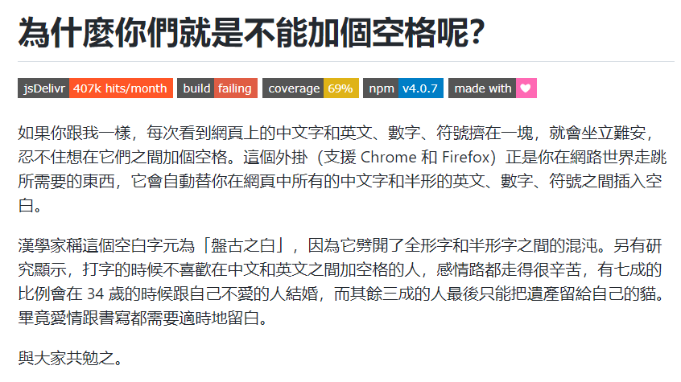

遵循标准的规范让人阅读有良好的体验，并存在一部分很看重格式的人，简称强迫症。

> 上图来自一插件作者的 [README](https://github.com/vinta/pangu.js)

平日中，依照社区所认可的最佳规范写作是一种好习惯。

从大体上，要遵循第一条链接中的规范，第二条链接则是做一个补充。

- [中文技术文档的写作规范](https://github.com/ruanyf/document-style-guide)
- [中文文案排版指北](https://github.com/mzlogin/chinese-copywriting-guidelines)

> VSCode 可以使用 [lint-md](https://github.com/lint-md/lint-md) 插件辅助格式