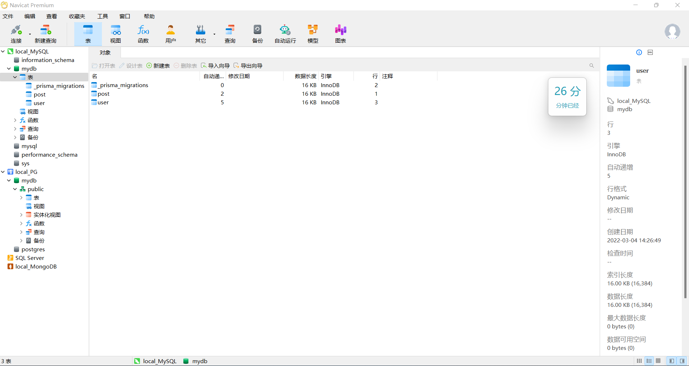

> 获取软件[点我](https://www.yutu.cn/softhtml/showsoft_6803.html)，或者线下联系我

除了数据库自带的可视化工具之外，还存在第三方工具，这里我要强推一个工具：**Navicat Premium**

该应用是数据库连接工具中最出色的一款了，因为它可以连接所有常用的数据库：

此外，还有优质的数据库建模功能，能够更轻松。

:::tip
PowerDesigner 是一款优秀的设计工具，但并不只存在数据库建模，部分功能是多余的，我们可以选择更加专一的工具
:::

总体展示图：

> 左侧已连接四种主流数据库：MySQL、SQL Server、PostgreSQL、 MongoDB

## 为什么需要

- 解决多个数据库连接，不必多个应用来回跳转
- 数据建模一体化，还可以根据当前数据库表格逆推导数据模型
- 更好的管理数据库视图、函数与存储过程（SQL 高级应用）
- 提供编码索引

:::tip
获取方式看该篇最上方
:::

:::note
勇于尝试新事物，而非腐朽致死
:::
