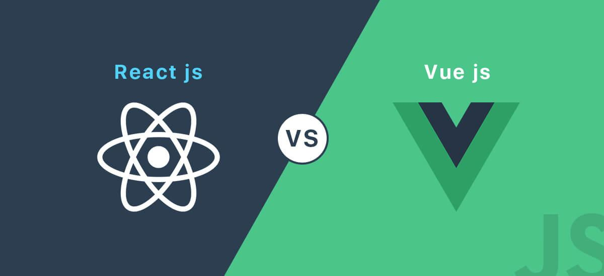

## 为什么要学习框架

时代更新迭代的块，现在越来越讲究效率与可用性，所以框架来了。

并且，当前的插件、UI 组件都在围绕前端框架定制开发。只有懂得框架的基础使用，才能使用它们。

> 如 [Naive UI](https://www.naiveui.com/zh-CN/light)、[AntD](https://ant.design/index-cn)、[Nuxt](https://v3.nuxtjs.org/)

:::tip
之所以定制性开发，因为这样才有真正的市场，非依赖开发比较少（还存在一点，饱和了），更多的是在追求在多个框架中都可以使用
:::

## 起步

学习框架 [Vue](https://cn.vuejs.org/)，这是一门**简单易上手**的框架，由它开始了解前端工具链、脚手架。

而 [React](https://zh-hans.reactjs.org/) 有一定难度（相比较 Vue），这是可选的学习，也许当你上手之后，会更喜欢它也说不定。

我个人是选择先学习 Vue，然后就开始了 React，一点是因为鄙视链（难度高一点的总站在高处）。而后续学习接触到的函数时编程也着实很迷人，其次是其生态圈庞大（插件与框架产品），这一点无可厚非。

:::tip
因为 Vue 低廉的学习成本，当前已成为前端基本技能之一。
:::

## 源源不断的框架

并不是只存在这两个框架，只是它们使用最为广泛与经典，先学习最常用的，再谈其他新奇事物。
