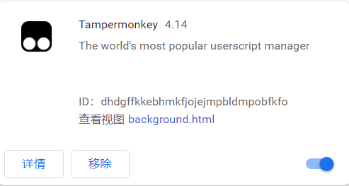
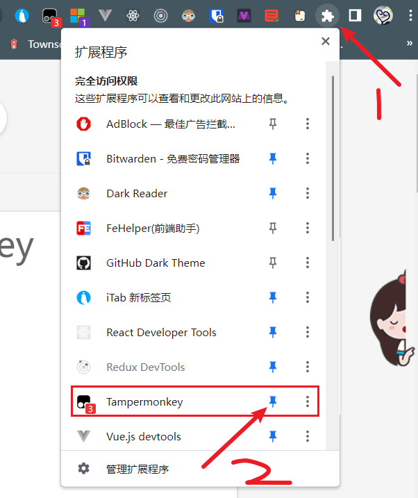
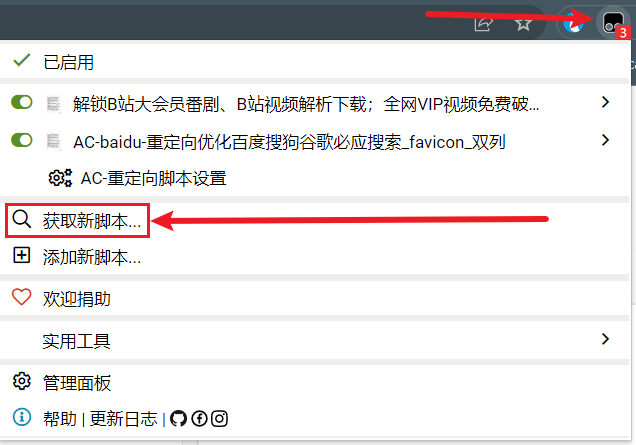
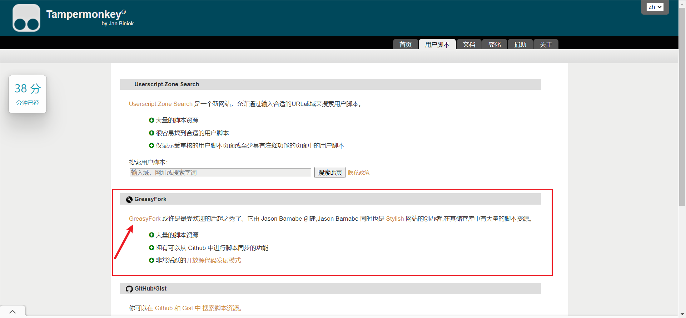
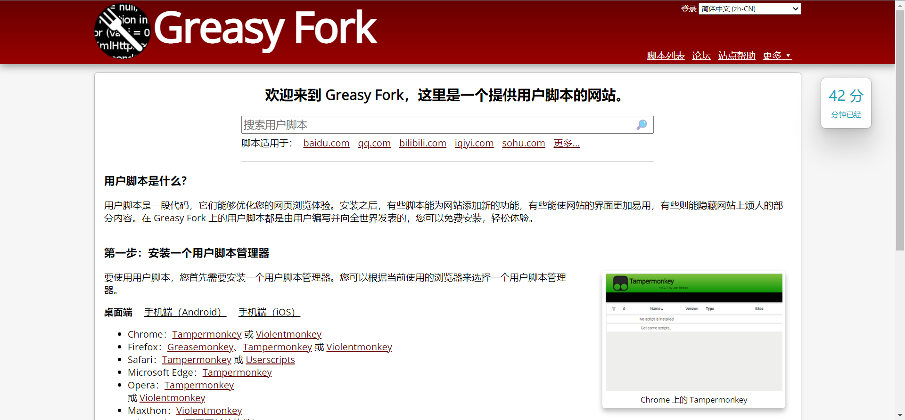

:::caution 注意
看一篇的前提条件是已安装了 Tampermonkey
:::

之前提及过，该插件是一个插件集，对此需要进行一些配置。

事实上，该插件的热度很高，只要搜一下就知道有什么效果（B 站上也有对应的介绍视频）。

## 脚本安装步骤

我在这里就给一个游玩步骤图：

1. 将插件固定在浏览器顶部，该步骤是为了更方便的控制

2. 点击置顶图标，获取新脚本

3. 此处我们去第二个站点。其风格较为好看

> 此处再贴一个直达链接：https://greasyfork.org/zh-CN

4. 之后便是搜索下载了，^(\*￣(oo)￣)^使用愉快

## 推荐的插件

安装该插件便是为了解决一些问题，此处我贴两个常用的，也是安装 Tampermonkey 的主要目的

### AC-baidu-重定向优化百度搜狗谷歌必应搜索*favicon*双列

> [点我直达](https://greasyfork.org/zh-CN/scripts/14178-ac-baidu-%E9%87%8D%E5%AE%9A%E5%90%91%E4%BC%98%E5%8C%96%E7%99%BE%E5%BA%A6%E6%90%9C%E7%8B%97%E8%B0%B7%E6%AD%8C%E5%BF%85%E5%BA%94%E6%90%9C%E7%B4%A2-favicon-%E5%8F%8C%E5%88%97)

该插件拥有优化搜索结果、控制布局、自动翻页等功能，这里不吹了，直接看插件首页吧。

### csdn 优化助手

> 注意，该插件并不叫该标题，只是太长了给它缩短，若想搜索找到它，在插件站点输入 csdn 搜索即可

> [点我直达](https://greasyfork.org/zh-CN/scripts/378351-%E6%8C%81%E7%BB%AD%E6%9B%B4%E6%96%B0-csdn%E5%B9%BF%E5%91%8A%E5%AE%8C%E5%85%A8%E8%BF%87%E6%BB%A4-%E4%BA%BA%E6%80%A7%E5%8C%96%E8%84%9A%E6%9C%AC%E4%BC%98%E5%8C%96-%E4%B8%8D%E7%94%A8%E5%86%8D%E7%99%BB%E5%BD%95%E4%BA%86-%E8%AE%A9%E4%BD%A0%E4%BD%93%E9%AA%8C%E4%BB%A4%E4%BA%BA%E6%83%8A%E5%96%9C%E7%9A%84%E5%B4%AD%E6%96%B0csdn)

净化 CSND 站点，去掉周围不必要的事物，可配置。

附上对比效果图：

