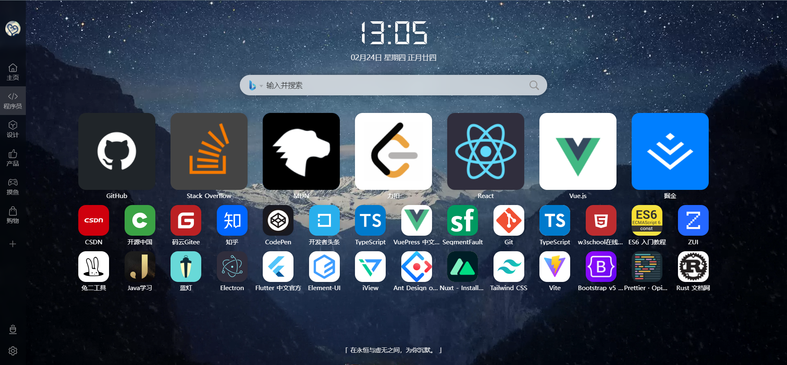
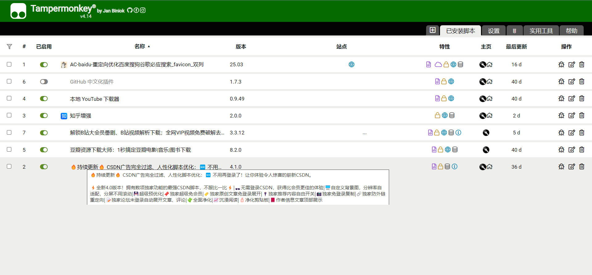
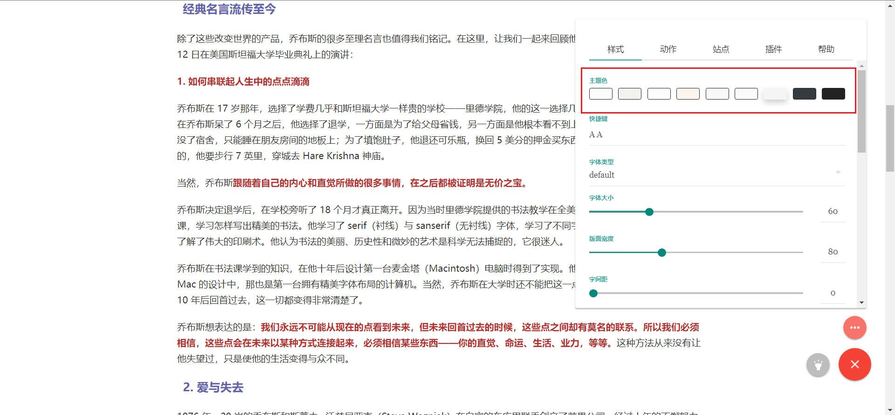
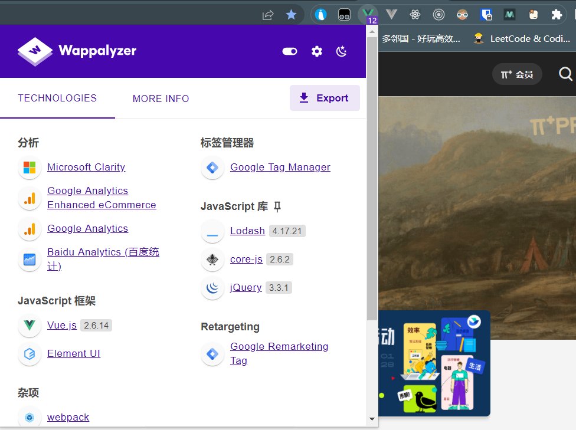

:::info
🔨 持续翻新中
:::

:::info
重新整理，尽量列举出功能与推荐理由
:::

## 通用

### AdBlock

**说明**：最佳广告拦截工具

**推荐理由**：简单粗暴，无需过多操作

### iTab 新标签页

**说明**：修改浏览器默认开始界面

**推荐理由**：一个不错的开始界面，可云同步保存布局。

### Dark Reader

**说明**：强开站点暗夜模式

**推荐理由**：不论站点是否存在主题功能，都可以开启，非常适合喜欢暗色系的朋友。

开启前：

开启后：

### Tampermonkey

> 具体使用且看另一篇：[Tampermonkey 使用](./Tampermonkey使用.md)

**说明**：一个插件集，即在该插件基础之上产生其他的插件

**推荐理由**：存在多种奇效插件，大型宝藏区。

### 简悦 - SimpRead

**说明**：进入更良好的阅读状态

**推荐理由**：沉浸式阅读，排除不必要的元素，可定制性强。

开启前：

开启后：

## 开发

### Wappalyzer

**说明**：探测网站使用的技术

**推荐理由**：简单粗暴，探测站点使用技术门类，快速了解整体逻辑与架构。

### Vue.js devtools beta & React Developer Tools & Redux DevTools

> 三个功能一致，就先放一块了

**说明**：前端框架开发插件

**推荐理由**：开发时使用，快速调试站点，可在进入对应的学习时再安装。

默认状态：

检测到对应框架时：

