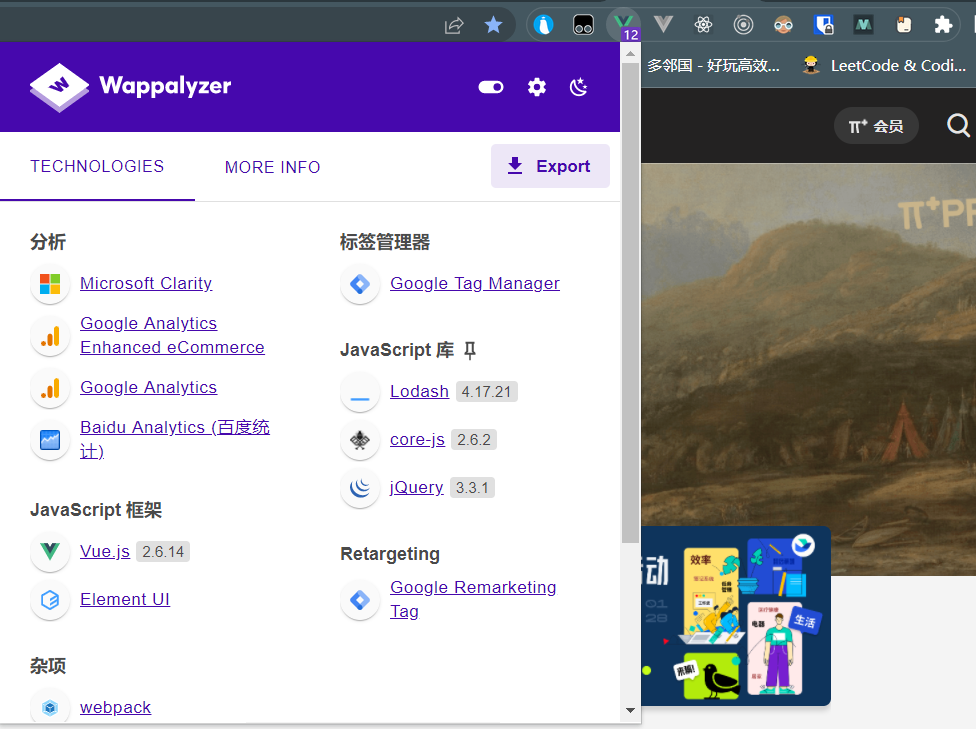
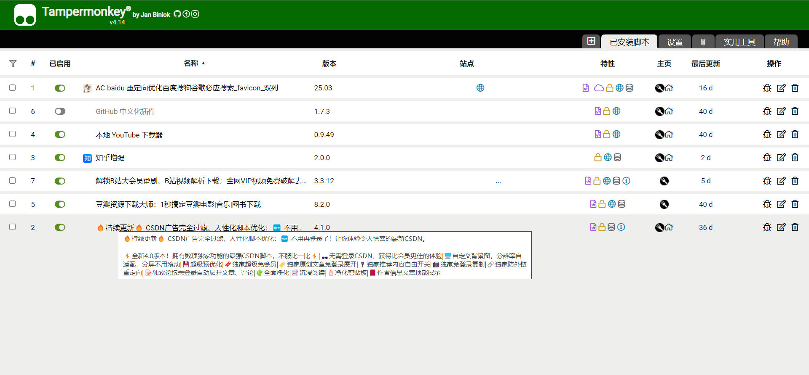
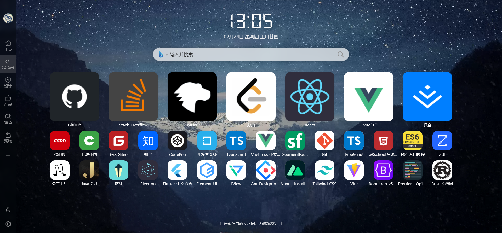
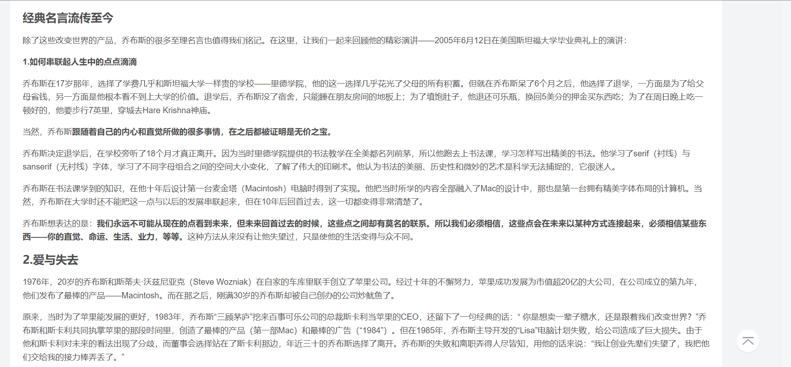
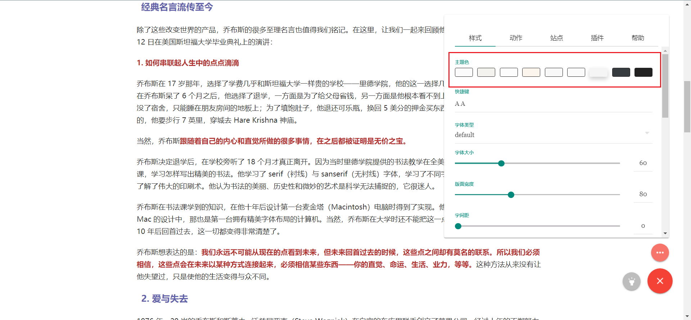
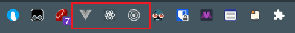

:::info
🔨 持续翻新中
:::

除了主要的代码编译器之外，就属浏览器陪伴的时间最长了。对此，选择一个合适的浏览器很有必要，再配合部分插件，提升使用体验。

## 安装方法

:::tip
以谷歌浏览器为例
:::

步骤：

1. 开启科学上网
2. 进入扩展程序（也可以直接在网址栏输入这串链接：chrome://extensions/）
   
3. 展开左侧菜单，找到入口。
   
4. 搜索对应的插件，一键安装即可。

## 插件推荐

重新整理，尽量列举出功能与推荐理由

### Wappalyzer

**说明**：探测网站使用的技术

**推荐理由**：简单粗暴，探测站点使用技术门类，快速了解整体逻辑与架构。

### Tampermonkey

> 具体使用且看另一篇：[Tampermonkey 使用](./Tampermonkey使用.md)

**说明**：一个插件集，即在该插件基础之上产生其他的插件

**推荐理由**：存在多种奇效插件，大型宝藏区。

### iTab 新标签页

**说明**：修改浏览器默认开始界面

**推荐理由**：一个不错的开始界面，可云同步保存布局。

### Dark Reader

**说明**：强开站点暗夜模式

**推荐理由**：不论站点是否存在主题功能，都可以开启，非常适合喜欢暗色系的朋友。

开启前：

开启后：

### 简悦 - SimpRead

**说明**：进入更良好的阅读状态

**推荐理由**：沉浸式阅读，排除不必要的元素，可定制性强。

开启前：

开启后：

### 开发

#### Vue.js devtools beta & React Developer Tools & Redux DevTools

> 三个功能一致，就先放一块了

**说明**：前端框架开发插件

**推荐理由**：开发时使用，快速调试站点，可在进入对应的学习时再安装。

默认状态：

检测到对应框架时：

